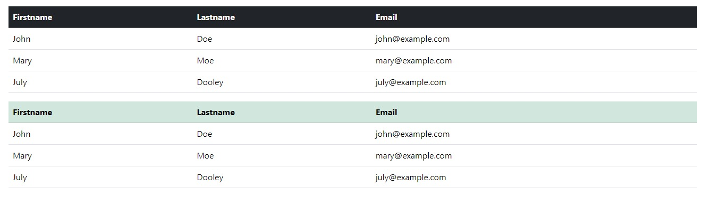
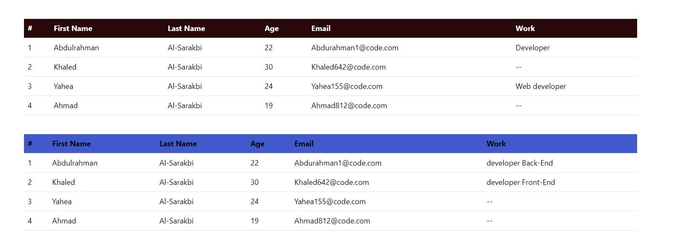

# Blulogix - Training 

# Task-1 :
* 1- Add new lib (Angular library) called ui
* 2- Add new component called table to ui lib
* 3- table component will display a simple table like the image below

# THE SOLUTION 

# Steps :
## Step 1: Create UI Library
In this step, we create a new Angular
library named `ui` using the following command in your terminal or cmd:
* `ng generate library ui`

## Step 2 : Design Table Component
To design our table component, we need to open  the `src/lib/ui/ui.component.ts` file and add the HTML code for our table as shown in the picture above.
To design our table component, we need to open the `table.component.ts` file located at `./libs/ui/src/lib/table/table.component.ts`.
To design our table component, we need to open the `table.component.html` file which is located at `./libs/ui/
We need to design our table component which is going to be part of our `ui` library. So let's go ahead and create it.
cmd :
`ng generate component ui/table --project=ui`
* `class="table table-hover"` This is to change the color of the font when you move the mouse button over it.

## Step 3: Code the table component
* Open the generated file (`src/lib/ui/table/table-1.component.html`) and add HTML code
to display the table as desired Then display the data passed from the TypeScript file (`src/lib/ui/table/table-1.component.ts`). 
* Adding necessary CSS formats.
* Modify the TypeScript code as necessary. We have passed the data through a single array named items. 

## Step 4: Repeat steps 2 and 3 for the second table-2

## Step 5: Scroll the component to display it on the Index page
* in the page (`src/app/app.component.html`) Add :
* * via the tag Table-1: (`<lib-table></lib-table>`) 
* * via the tag Table-2: (`<lib-table-2></lib-table-2>`)

# Notes :
* I used the Bootstrap library for direct links and CSS formatting 
* Node: 20.11.1
* Angular: 17.3.1

# Review : 
*  Trining Youtube : (`https://youtu.be/hIEbJkP1M5E?si=LzdEoMXxroVDJgw8`).
*  Angular  Official Documentation : (`https://angular.io/guide/creating-libraries`).
*  Angular Book (PDF).
